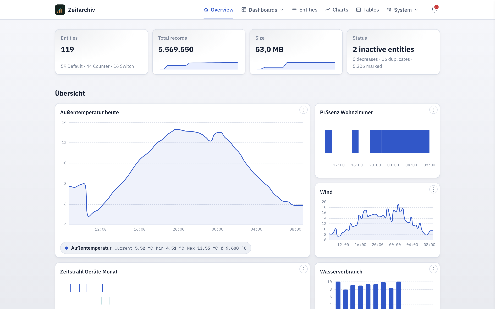
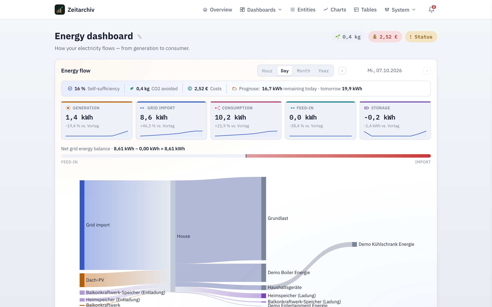
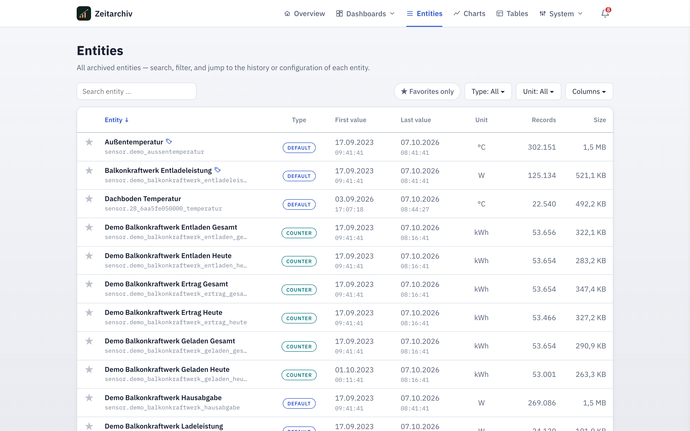
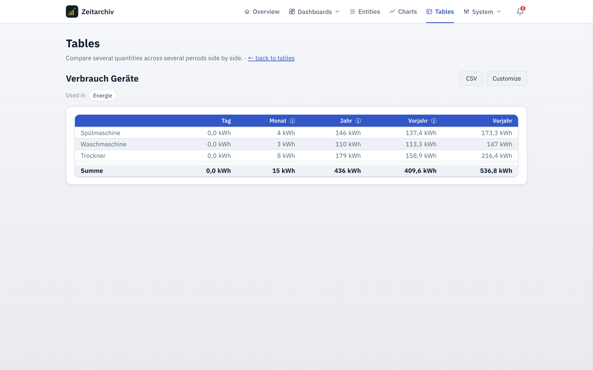
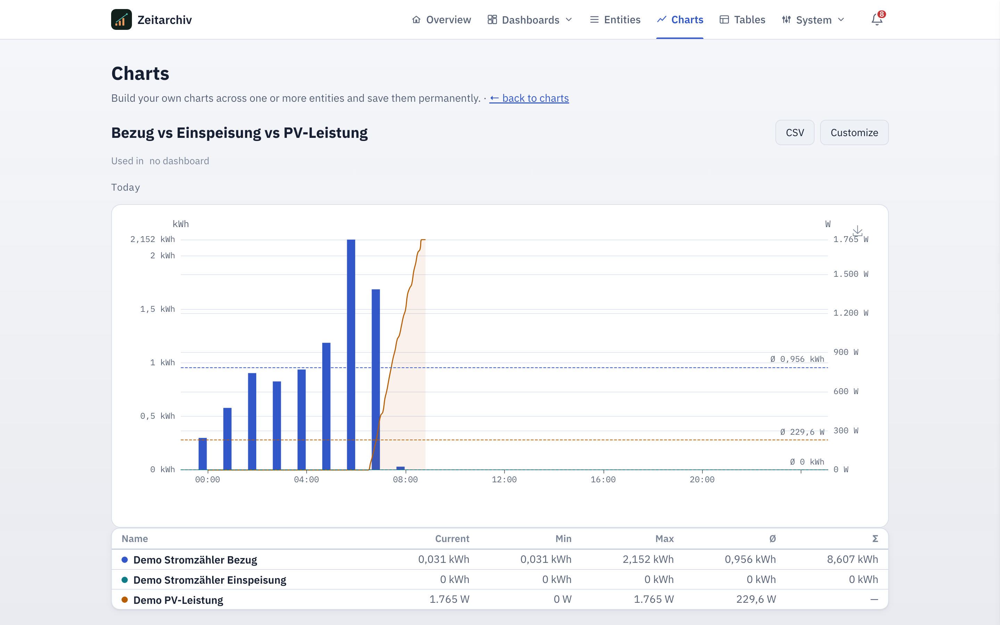
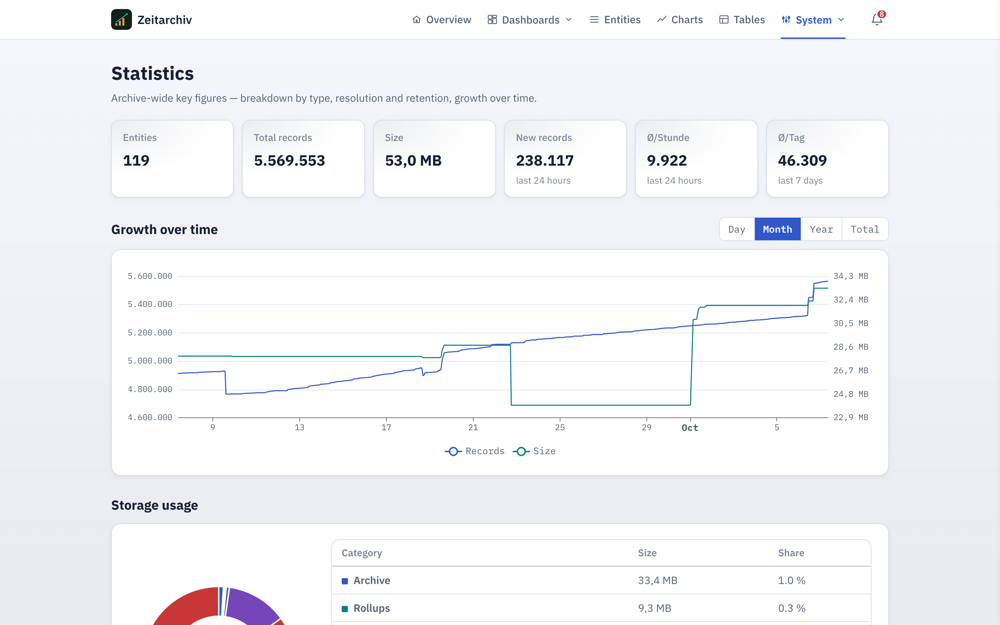

<p align="center">
  
</p>

<h1 align="center">Zeitarchiv App</h1>

<p align="center">
  Long-term, compact time series for Home Assistant.<br>
  <sub>PARQUET + ZSTD · INGRESS · ENERGY DASHBOARD · CHARTS · TABLES · IMPORT · BACKUP · DEMO MODE</sub>
</p>

<p align="center">
  
  
  
  <a href="https://github.com/bertel2020/HA-Apps/actions/workflows/zeitarchiv-tests.yml"></a>
  <a href="https://github.com/bertel2020/HA-Apps/actions/workflows/zeitarchiv-image.yml"></a>
  <a href="https://github.com/bertel2020/HA-Apps/blob/main/zeitarchiv/LICENSE"></a>
</p>

<p align="center">
  <a href="https://buymeacoffee.com/bertel2020"></a>
  <a href="https://ko-fi.com/bertel2020"></a>
  <a href="https://paypal.me/RobertoMartins"></a>
</p>

<p align="center"><em><a href="README.md">Deutsche Version</a></em></p>

Zeitarchiv preserves selected state changes independently of the retention
period of the Home Assistant recorder. The
[Zeitarchiv integration](https://github.com/bertel2020/HA-Zeitarchiv) collects
the desired values; this app stores, compacts, searches and visualizes them.

A detailed, task-oriented user guide:
[docs/en/user-guide.md](docs/en/user-guide.md).

## What Zeitarchiv is

The Home Assistant recorder is designed for short retention and day-to-day
operation — which is not enough for analyses spanning months or years.
Zeitarchiv closes this gap: it takes selected state changes from Home
Assistant, compacts completed months in a columnar, lossless format, and uses
them to provide fast long-term analyses — as a dedicated application embedded
in the Home Assistant interface, not as yet another Lovelace card.

Zeitarchiv consists of two separate, independently versioned parts:

- The **[Zeitarchiv integration](https://github.com/bertel2020/HA-Zeitarchiv)**
  runs inside Home Assistant itself and decides which entities are archived.
- This **app** runs as a standalone add-on, receives the values via a
  token-secured API, stores them permanently, and provides archive, analysis
  and data maintenance through Ingress.

## At a glance

| | |
| --- | --- |
| **Stores permanently** | Historical data is retained regardless of how long Home Assistant's own retention runs |
| **Stays fast** | Charts over weeks, months or years load quickly, even with a very long history |
| **Your own dashboards** | Freely combinable charts (line, bar, timeline) and comparison tables on any number of your own dashboards |
| **Energy dashboard** | Dedicated Sankey view of the energy flow with self-sufficiency, cost and CO₂ analysis — enabled with one click if desired |
| **Data maintenance** | Detect, correct or clean up outliers, gaps and duplicates |
| **Data import** | Import existing history from Symcon, CSV files or directly from Home Assistant |
| **Backup** | Verifiable, portable ZIP backups with restore and schedule |
| **Demo mode** | Separate instance with synthetic showcase data, completely isolated from the real data — switchable via add-on option |
| **Secured** | Runs behind Home Assistant's own login, write access strictly separated from the rest of the interface |

## How the pieces fit together

```text
Home Assistant entities
          │ state_changed
          ▼
Zeitarchiv integration
  Filter · Queue · Batch · Retry
          │ POST /api/write + bearer token
          ▼
Zeitarchiv app
  Hot buffer ──► Monthly archive ──► Rollups
          │
          └────► Ingress interface
                 Charts · Tables · Maintenance · Export
```

Responsibilities are deliberately kept separate:

- The **integration** decides which Home Assistant entities are sent and keeps
  transmission errors away from Home Assistant.
- The **app** decides on resolution, retention, storage, aggregation and
  presentation. Entity resolution serves presentation; incoming values are no
  longer discarded based on a minimum time interval.

## Installation

### 1. Install the app

[](https://my.home-assistant.io/redirect/supervisor_add_addon_repository/?repository_url=https%3A%2F%2Fgithub.com%2Fbertel2020%2FHA-Apps)
[](https://my.home-assistant.io/redirect/supervisor_addon/?addon=c1c17729_zeitarchiv&repository_url=https%3A%2F%2Fgithub.com%2Fbertel2020%2FHA-Apps)

The first button adds the repository to the add-on store, the second opens
the Zeitarchiv installation page directly. Alternatively, manually:

**Via the add-on store:** In Home Assistant, open **Settings → Add-ons →
Add-on store → ⋮ → Repositories**, enter `https://github.com/bertel2020/HA-Apps`
and add it. **Zeitarchiv** then appears in the store; install and start it.

Installation and updates use prebuilt images for `amd64` and `aarch64`
(`ghcr.io/bertel2020/zeitarchiv-{arch}`) that a GitHub workflow builds with
every release. The Home Assistant host therefore builds nothing locally;
updates are correspondingly fast and the Supervisor shows the progress.

**Manual:** Alternatively, copy the contents of this directory to the Home
Assistant host as `/addons/zeitarchiv` and reload the store. Even then the
Supervisor pulls the prebuilt image; if you really want to build the
Dockerfile locally, remove the `image:` line from `config.yaml`.

After starting, Zeitarchiv appears in the Home Assistant sidebar. The full
interface runs through the authenticated Supervisor Ingress; a separate user
account is not required.

### 2. Copy the API token

Open Zeitarchiv and copy the automatically generated API token under
**Settings → Connection**. The token can be regenerated there later.

### 3. Connect the integration

Install the [Zeitarchiv integration](https://github.com/bertel2020/HA-Zeitarchiv)
(via HACS or manually, see its README) and set it up in Home Assistant via
**Settings → Devices & services → Add integration → Zeitarchiv**. You need the
host, port `8127` and the API token.

### 4. Define archive filters

On the integration tile, open **Configure → Edit archive filters** and select
domains, entities, areas or devices. Without matching filters the app waits
for data but archives nothing.

## Core features

Details on using each page are in the
[user guide](docs/en/user-guide.md); this is only a functional overview.

**Dashboards.** Charts and comparison tables can be arranged as tiles on any
number of freely named dashboards — not just on a single start page. The
overviews of dashboards, charts and tables offer search, selectable sorting
and an independent "favorites first" switch.

**Energy dashboard.** A standalone view of the entire energy flow as a Sankey
diagram, activatable via a tile on the dashboard overview — grid import, any
number of generators, any number of storage units and consumers (optionally
grouped into freely named groups), each with hour/day/month/year navigation:

- **Key figures and rings:** Generation, consumption, grid import, storage and
  feed-in as KPI tiles (with several storage units/generators as a sum with a
  breakdown in the tooltip) — a click leads to the chart of the respective
  entity with the currently selected period, or via a short selection dialog
  when several entities are possible; rings for self-sufficiency, self-
  consumption, storage SOC and efficiency (combined capacity-weighted with
  several storage units) with a clickable monthly trend over the last three
  years.
- **Costs and CO₂:** Balance from an electricity price or CO₂ entity, or from
  a custom fixed price if no suitable entity exists — if the balance is in the
  plus (more earned/avoided than paid/caused), this is highlighted
  specifically rather than just shown as a number.
- **PV yield forecast** and a **daily load profile** (hourly consumption of
  the last 7 days; for month/year, averaged by weekday instead).
- **Status check:** checks the energy balance for plausibility, reports
  stale sensor values instead of silently smoothing them over, and flags
  consumers/groups that are well above their usual average (threshold
  adjustable, can also be switched off).

**Entities and histories.** Every archived entity has its own history view
with period navigation from hour to decade, comparison with the previous
period or previous year, and individually configurable resolution, retention
and rounding. An optional, purely app-internal display name overrides Home
Assistant's own name in the presentation only, if needed.

**Housekeeping.** A dedicated area for things that are otherwise easy to
overlook: detected duplicates, inactive entities, contradictory configuration
combinations (e.g. a gap detection that can never trigger because of the
resolution or a value-change filter), unused charts/tables, free space on the
host file system, as well as storage, retention and rotation management in one
place.

**Notices.** The bell in the header bundles system notices — recommended
maintenance, failed backup/retention/import runs, available app and
integration updates, and several housekeeping checks. Individual notices can
be muted temporarily or permanently; real errors never. A rotating practical
tip complements the notices and can be hidden individually or switched off
entirely. The same notices are available to the Home Assistant integration via
`GET /api/notices` — the basis for Home Assistant Repairs and automatable
`binary_sensor` entities on the Zeitarchiv device. The same endpoint also
reports the last successful backup; the integration turns this into a
dedicated sensor entity as an automation trigger for an offsite target (see
below).

**Running operations.** Actions that take noticeable time — imports, cleanup,
backup, retention, rotation, index optimization — show their status on the
button, additionally as a progress bar where countable, and globally at the
bell: they keep running in the background even when you switch pages. This is
also where operations that start on their own are listed (storage index check
after startup, subsequent build-up of analysis levels). Since several of them
pause all write access for their duration, the bell answers the question of
why the app is waiting right now.

**Charts and tables.** Custom charts can overlay several entities with
different units. Comparison tables combine individual entities, sum groups and
formulas across freely chosen time columns (e.g. month by month over several
years).

**Data maintenance.** Outliers, gaps, duplicate timestamps and repeats that
are equal after rounding are detected and can be corrected individually or
removed via an initially reversible soft-delete mark. Marked values are only
physically removed by a separate, final step.

**Statistics.** Shows inventory, storage requirements, growth and growth over
time; the SQLite index can be optimized in a controlled way when needed.

**Demo mode.** An add-on option lets the app run completely separated from
the real data with synthetic showcase/test data — a simulated household with
PV system, wallbox, balcony power plant and home battery. It generates itself
on first start, can be kept current on a schedule or supplemented or
regenerated manually at any time, and removed without a trace — handy for a
first impression or a permanent shop-window instance. Details: [User guide →
Demo mode](docs/en/user-guide.md#demo-mode).

**Import and export.** Existing history can be taken over from Symcon exports,
freely mappable CSV files, or directly from the running Home Assistant
instance. The recommended full import automatically joins older hourly
statistics with the more recent raw history without temporal overlap; both
sources can also still be imported individually. Every import remains
traceable as a report; timestamps that already exist are never duplicated. The
current month is automatically supplemented in the hot buffer; historical gaps
in completed archives can optionally be closed. The dry run additionally
provides a detailed debug file for diagnosis. The complete raw data history of
an entity can be exported as CSV.

## Screenshots

<p align="center">
  <a href="docs/img/en/overview.png"></a>
  <a href="docs/img/en/energy-dashboard.png"></a>
  <a href="docs/img/en/entities.png"></a>
  <br><sub>Home page &nbsp;·&nbsp; Energy dashboard &nbsp;·&nbsp; Entity overview</sub>
</p>

<p align="center">
  <a href="docs/img/en/table-2.png"></a>
  <a href="docs/img/en/chart-24.png"></a>
  <a href="docs/img/en/statistics.png"></a>
  <br><sub>Comparison table &nbsp;·&nbsp; Chart &nbsp;·&nbsp; Statistics</sub>
</p>

<p align="center"><sub>More views: <a href="docs/img/en">docs/img/en</a>.</sub></p>

## Storage and retention

```text
current month         completed months             long-term queries
Hot buffer (CSV)  ─►  Parquet + zstd           ─►  precomputed rollups
```

The current month is kept as an appendable CSV file. Completed months are
compressed in a columnar, lossless format; precomputed rollups (hour to year)
derived from them make long-term analyses fast without having to aggregate
raw data on every query. The automatic retention enforcement, disabled by
default, removes values beyond the period configured per entity; entities
marked **Unlimited** are left untouched.

## Backup and restore

Complete, portable ZIP backups (index, hot buffer, monthly archives, rollups)
can be created, scheduled, verified and restored — in addition to, not instead
of, the automatic Home Assistant snapshots. A backup from elsewhere (e.g.
another installation or one stored externally before a device move) can be
imported via drag &amp; drop. A restore is verified before being applied
(checksums, ZIP structure, index integrity) and is rollback-capable: the
existing data is moved aside before being overwritten, not deleted.

Zeitarchiv itself does not speak S3/WebDAV/SMB — for an offsite target, the
app instead reports the last successful backup to the Home Assistant
integration, which turns it into a sensor entity and an automation blueprint
(see the integration README). The actual transfer is then handled by an
automation of your own, e.g. using `rclone`.

## Security and network

| Access | Reachable scope |
| --- | --- |
| Supervisor Ingress, internal port `8099` | Full interface and administration |
| Published port `8127` | Only `GET /api/health`, `POST /api/write` and `GET /api/notices` |

All three API endpoints on port `8127` require a bearer token. The interface,
queries, exports, backups, imports and administration routes respond with
HTTP 404 there. Import paths are normalized, archives are checked for zip-bomb
patterns, and dynamic content is served with restrictive security headers.

## Settings and configuration

Appearance, archiving defaults, connection, diagnostics and more are managed
entirely in the app and stored in the Zeitarchiv index — see [User guide →
Settings in detail](docs/en/user-guide.md#settings-in-detail). Storage,
retention and rotation live in the dedicated [Housekeeping area](docs/en/user-guide.md#housekeeping).
The Supervisor options are `timezone` (IANA time zone, default
`Europe/Berlin`) and `demo_mode` (switches the app to a synthetic
showcase/test instance, see [User guide →
Demo mode](docs/en/user-guide.md#demo-mode)) — both need an add-on restart after
a change.

At startup and after data imports, Zeitarchiv automatically reconciles the
derived index metrics with the Parquet archive and hot buffer to make
inconsistencies visible early.

For diagnostics, a bounded local live log buffer and the Supervisor history
are available. Secrets are masked before output; request IDs, stable event
codes and aggregated ingest metrics make troubleshooting easier without a
permanent log entry per measurement. Details:
[Logging operations](docs/logging.md).

## Known limitations

- The app is designed for a single local Home Assistant system and one shared
  API token; there is currently no multi-user or multi-tenant separation.
- The Ingress pages are not intended as standalone Lovelace cards or public
  chart URLs.
- Manual delete and retention actions can be permanent. Before larger
  interventions, a verified backup should be created.

## Why Zeitarchiv?

<details>
<summary>Why does Zeitarchiv exist – despite Home Assistant long-term statistics, the energy dashboard and InfluxDB/Grafana?</summary>

Zeitarchiv did not come about because I was unaware of the existing
solutions. Quite the opposite: I spent a long and intensive time with
InfluxDB, VictoriaMetrics and Grafana and tried various approaches. These
systems are very powerful, but were too complex for my use case and, despite
considerable setup effort, did not deliver the ease of use I was looking for.

### Home Assistant recorder and long-term statistics

The Home Assistant recorder is first and foremost the system's operational
database. Among other things, it feeds the history view, the logbook,
dashboard cards and the long-term statistics.

By default, the full state history is only kept for a limited period. This
period can be extended, but the operational database then grows as well.

For suitable numeric sensors, Home Assistant additionally offers long-term
statistics. These are entirely sufficient for many applications, but in the
long run store statistical aggregations or sums rather than necessarily every
original state change at its original temporal resolution. In addition,
entities must meet certain requirements, for example a suitable
`state_class`. Other sensors and non-numeric states cannot be analyzed
long-term in the same way.

Zeitarchiv therefore takes a different approach:

- Only explicitly selected entities are archived.
- The transmitted state changes are initially retained in full.
- Resolution, rounding and retention can be configured per entity.
- Entities can be retained indefinitely if needed.
- The archive is independent of the retention period of the Home Assistant
  recorder.

An important focus here is the compact storage of large amounts of data.
Completed months are compressed in a columnar format with Parquet and
Zstandard. In addition, precomputed rollups ensure that analyses over months
or years do not have to process all raw data every time. Zeitarchiv is
therefore designed for archives spanning many years and datasets with many
millions up to several hundred million measurements.

Zeitarchiv is thus not meant to be a second complete Home Assistant database,
but a deliberately selected, long-term usable measurement archive.

### Visualization and long-term comparisons

Home Assistant offers good standard views for the current and short-term
history. The long-term statistics can also be visualized meaningfully for many
sensors.

As soon as I wanted to create more complex and regularly recurring
comparisons, however, implementation became considerably more laborious. These
include, for example:

- current period compared to the previous year
- several years side by side
- month comparisons across different years
- several entities with different units in one chart
- tables with freely selectable time columns
- sums of several entities
- calculated values and custom formulas
- permanently saved, thematically separated analyses

It is exactly at this point that Grafana did not fully convince me either.
Grafana can in principle represent time shifts and comparisons. A convenient
year-over-year comparison, however, is not a general built-in feature that can
simply be switched on for arbitrary data series. Depending on the data source
and the desired presentation, you need customized queries, time shifts,
transformations or multiply configured data series and panels.

For simple queries this is feasible. As soon as several entities, different
periods, sums or changing analyses are involved, however, configuration and
maintenance effort quickly becomes considerable.

My goal was an operation where I select a period and then simply activate
"compare previous year". The queries and time shifts required for that should
be generated by the application itself.

Zeitarchiv therefore offers:

- comparison with the previous period or previous year directly in the history
  view
- navigation from one hour up to a decade
- charts with several entities and different units
- freely configurable comparison tables
- sum groups and custom formulas
- freely nameable dashboards
- reusable charts and tables
- direct switching between a key figure and the entity history

### Cleaning up and maintaining historical data

Another important point is data quality. Sensors occasionally deliver wrong
values, briefly jump to zero or produce implausible meter readings.
Duplicates, data gaps and permanently repeated values also occur.

Home Assistant has tools for checking and correcting certain statistics
values. There is, however, no end-to-end workspace in which the original
history of selected entities can be systematically examined, corrected and
cleaned up.

InfluxDB or VictoriaMetrics also store time series very efficiently. Finding
and conveniently correcting individual Home Assistant measurements, however,
is not their primary use case. For that you need queries, database tools or
your own maintenance processes. Grafana visualizes the data, but is not an
interface for the actual data maintenance.

Zeitarchiv therefore provides these tasks directly in the interface:

- detect outliers, gaps and duplicates
- correct individual measurements after the fact
- hide suspicious values via soft delete first
- review changes before data is permanently removed
- detect inactive entities
- close historical gaps through imports
- not re-create existing timestamps on import
- show contradictory settings and unused analyses
- document import, backup and maintenance operations traceably

A single faulty sensor value should not distort sums, charts or comparisons
years later.

### Energy dashboard

The Home Assistant energy dashboard is a good standard solution and the right
starting point for most installations. Zeitarchiv is not meant to replace it.

The Zeitarchiv energy dashboard puts more emphasis on long-term comparisons
and additional analyses:

- Sankey view with several generators and storage units
- freely nameable consumer groups
- self-sufficiency and self-consumption
- storage level and efficiency
- cost and CO₂ balance
- PV yield forecast
- daily load profile
- navigation from hour to year
- monthly trends over several years
- direct switch from a key figure to the long-term entity history
- plausibility check of the energy balance
- notices about stale sensor values
- detection of unusually high consumers

Both energy dashboards can be used side by side without any problem.

### Why not InfluxDB, VictoriaMetrics and Grafana?

InfluxDB, VictoriaMetrics and Grafana are powerful, proven systems. Anyone who
has already set them up, masters the query languages and can comfortably
build their desired analyses with them may not need Zeitarchiv.

For my requirements, however, these solutions meant:

- installing and operating several standalone components
- configuring data transfer and filters
- writing queries in InfluxQL, Flux, SQL, MetricsQL or PromQL
- constructing time shifts and year-over-year comparisons yourself
- configuring and maintaining panels and dashboards individually
- defining retention rules
- managing database, users and access rights
- setting up your own backup and restore processes
- using additional tools or queries for data corrections

Despite a long time spent with these systems, I did not reach with them the
combination of simple operation, long-term comparisons, data maintenance and
Home Assistant integration that I had in mind.

Zeitarchiv is deliberately less universal. In return, archiving,
visualization, year-over-year comparison, data maintenance, import, export,
backup and restore are combined in an interface tailored to Home Assistant.

### My personal background

I have been using Symcon for about 13 years and have by now stored more than
130 million measurements there from the areas of energy, temperature, weather
and operations.

I use Home Assistant mainly for control, automations and integrating the most
diverse systems. What I value about Symcon, on the other hand, is the
uncomplicated long-term storage, quick comparisons and the ability to correct
faulty historical values after the fact.

Zeitarchiv arose from the wish to make this way of working possible directly
in Home Assistant — with significantly less setup and maintenance effort than
a self-assembled solution of an external time series database and Grafana.

In short: Zeitarchiv is aimed at users who not only want to keep selected data
long-term and space-efficiently, but also want to conveniently compare,
visualize, check, back up and, when necessary, correct it.

</details>

## Disclaimer

Zeitarchiv is a privately developed, free open-source project and is provided
without warranty or guarantee. Use is at your own risk; in particular, no
guarantee can be given for error-free operation or for the correctness,
completeness, availability or lasting preservation of stored data. Therefore,
make independent backups of your data regularly.

## License

This project is licensed under the [MIT License](LICENSE).
Copyright 2026 bertel2020.

The third-party components used and their licenses are listed in
[THIRD_PARTY_LICENSES.md](THIRD_PARTY_LICENSES.md).

---

<p align="center">
  <a href="https://github.com/bertel2020/HA-Zeitarchiv">Set up the integration</a>
  ·
  <a href="https://github.com/bertel2020/HA-Apps/blob/main/zeitarchiv/CHANGELOG.md">Changelog</a>
  ·
  <a href="https://github.com/bertel2020/HA-Apps/blob/main/zeitarchiv/DOCS.md">App store documentation</a>
</p>
