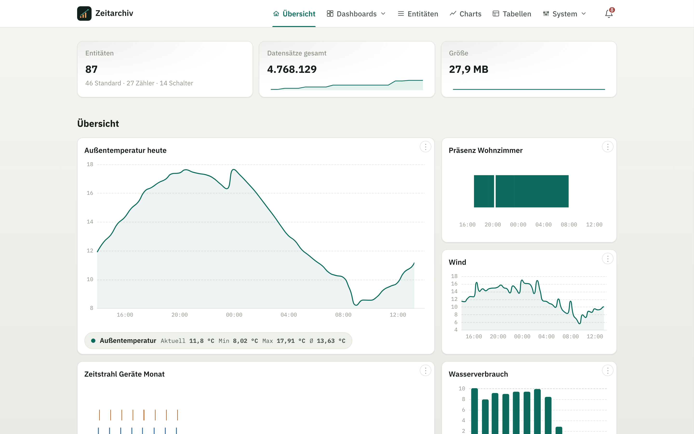
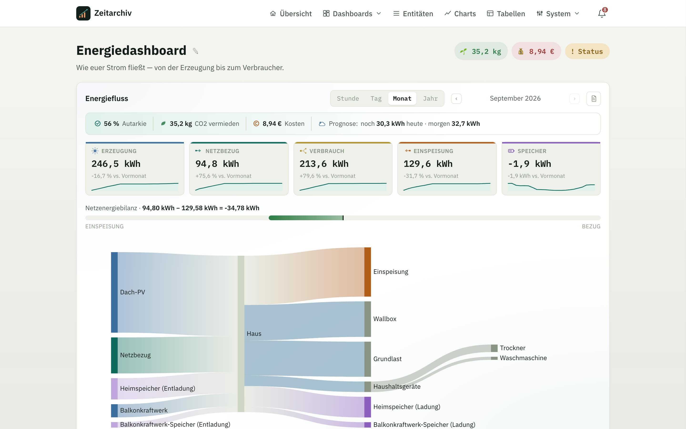
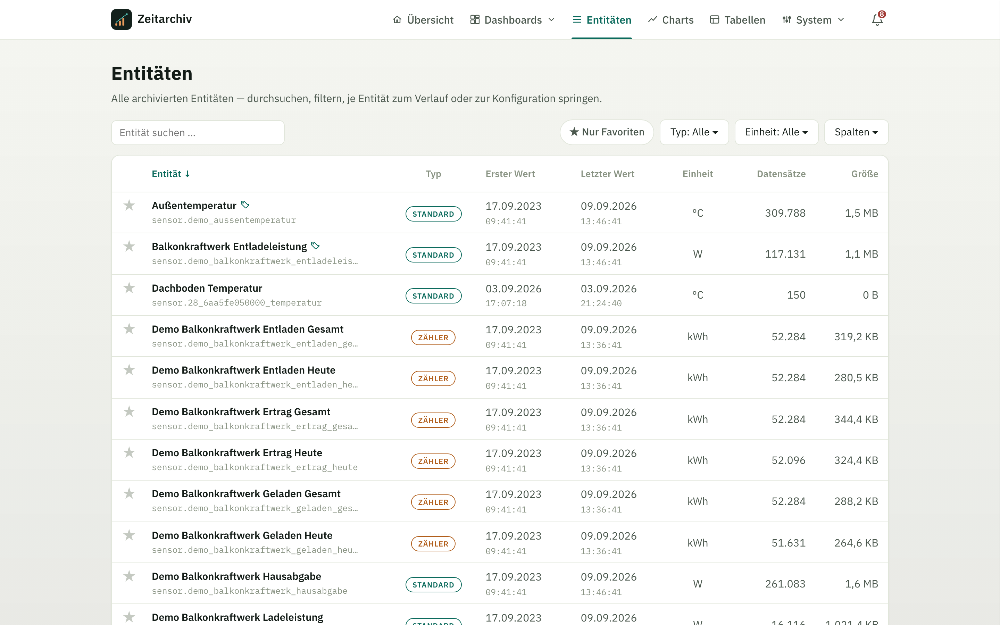
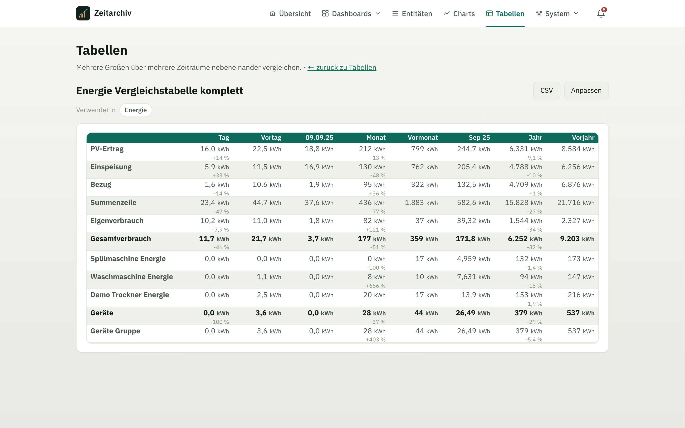
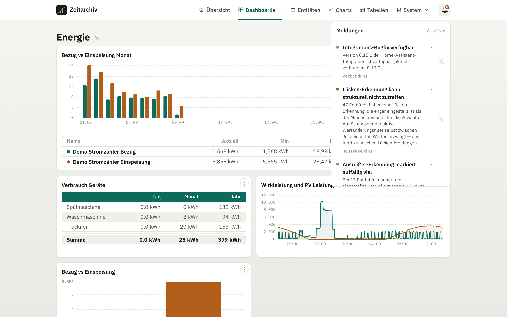
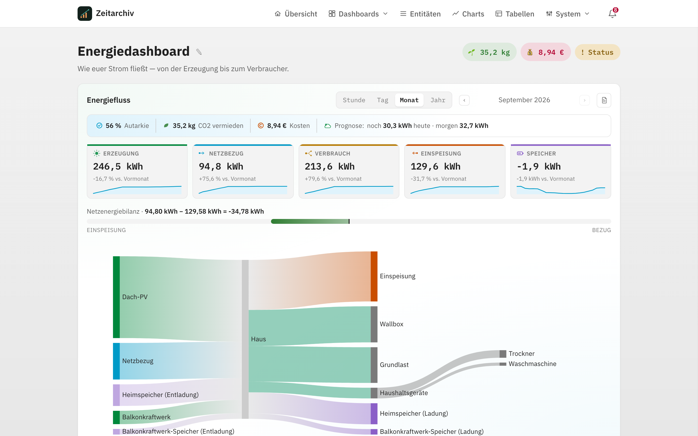

<p align="center">
  
</p>

<h1 align="center">Zeitarchiv App</h1>

<p align="center">
  Langfristige, kompakte Zeitreihen für Home Assistant.<br>
  <sub>PARQUET + ZSTD · INGRESS · ENERGIEDASHBOARD · CHARTS · TABELLEN · IMPORT · BACKUP</sub>
</p>

Zeitarchiv bewahrt ausgewählte Zustandsänderungen unabhängig von der
Aufbewahrungsdauer des Home-Assistant-Recorders auf. Die
[Zeitarchiv-Integration](https://github.com/bertel2020/HA-Zeitarchiv) sammelt
die gewünschten Werte; diese App speichert, verdichtet, durchsucht und
visualisiert sie.

Ausführliches, aufgabenorientiertes Benutzerhandbuch:
[docs/user-guide.md](docs/user-guide.md).

## Was Zeitarchiv ist

Der Home-Assistant-Recorder ist auf kurze Aufbewahrung und den laufenden
Betrieb ausgelegt — für Auswertungen über Monate oder Jahre reicht das nicht.
Zeitarchiv schließt diese Lücke: Es übernimmt ausgewählte Zustandsänderungen
von Home Assistant, verdichtet abgeschlossene Monate spaltenorientiert und
verlustfrei, und stellt daraus schnelle Langzeitauswertungen bereit — als
eigene, in die Home-Assistant-Oberfläche eingebettete Anwendung, nicht als
weitere Lovelace-Karte.

Zeitarchiv besteht aus zwei getrennten, unabhängig versionierten Teilen:

- Die **[Zeitarchiv-Integration](https://github.com/bertel2020/HA-Zeitarchiv)**
  läuft in Home Assistant selbst und entscheidet, welche Entitäten
  archiviert werden.
- Diese **App** läuft als eigenständiges Add-on, empfängt die Werte über
  eine token-gesicherte API, speichert sie dauerhaft und stellt Archiv,
  Auswertung und Datenpflege über den Ingress bereit.

## Auf einen Blick

| | |
| --- | --- |
| **Speichert dauerhaft** | Verlaufsdaten bleiben erhalten, unabhängig davon, wie lange Home Assistants eigene Aufbewahrung läuft |
| **Bleibt schnell** | Charts über Wochen, Monate oder Jahre laden zügig, auch bei sehr langer Historie |
| **Eigene Dashboards** | Frei kombinierbare Charts (Linie, Balken, Zeitstrahl) und Vergleichstabellen auf beliebig vielen eigenen Dashboards |
| **Energiedashboard** | Eigene Sankey-Ansicht des Energieflusses mit Autarkie-, Kosten- und CO₂-Auswertung — auf Wunsch mit einem Klick aktiviert |
| **Datenpflege** | Ausreißer, Lücken und Duplikate erkennen, korrigieren oder bereinigen |
| **Datenübernahme** | Bestehende Historie aus Symcon, CSV-Dateien oder direkt aus Home Assistant importieren |
| **Sicherung** | Prüfbare, portable ZIP-Backups mit Wiederherstellung und Zeitplan |
| **Abgesichert** | Läuft hinter Home Assistants eigenem Login, Schreibzugriff strikt vom Rest der Oberfläche getrennt |

## Zusammenspiel

```text
Home-Assistant-Entitäten
          │ state_changed
          ▼
Zeitarchiv-Integration
  Filter · Queue · Batch · Retry
          │ POST /api/write + Bearer-Token
          ▼
Zeitarchiv App
  Hot Buffer ──► Monatsarchiv ──► Rollups
          │
          └────► Ingress-Oberfläche
                 Charts · Tabellen · Pflege · Export
```

Die Verantwortlichkeiten bleiben bewusst getrennt:

- Die **Integration** entscheidet, welche Home-Assistant-Entitäten gesendet
  werden, und hält Übertragungsfehler von Home Assistant fern.
- Die **App** entscheidet über Auflösung, Aufbewahrung, Speicherung,
  Aggregation und Darstellung. Die Entitäts-Auflösung dient der Darstellung;
  eingehende Werte werden nicht mehr über einen zeitlichen Mindestabstand
  verworfen.

## Installation

### 1. App installieren

[](https://my.home-assistant.io/redirect/supervisor_add_addon_repository/?repository_url=https%3A%2F%2Fgithub.com%2Fbertel2020%2FHA-Apps)
[](https://my.home-assistant.io/redirect/supervisor_addon/?addon=c1c17729_zeitarchiv&repository_url=https%3A%2F%2Fgithub.com%2Fbertel2020%2FHA-Apps)

Der erste Button trägt das Repository im Add-on-Store ein, der zweite öffnet
direkt die Installationsseite von Zeitarchiv. Alternativ von Hand:

**Über den Add-on-Store:** In Home Assistant **Einstellungen → Add-ons →
Add-on-Store → ⋮ → Repositories** öffnen, `https://github.com/bertel2020/HA-Apps`
eintragen und hinzufügen. **Zeitarchiv** erscheint danach im Store; installieren
und starten.

Installation und Updates laufen über vorgebaute Images für `amd64` und
`aarch64` (`ghcr.io/bertel2020/zeitarchiv-{arch}`), die ein GitHub-Workflow
bei jedem Release erzeugt. Der Home-Assistant-Host baut also nichts lokal;
Updates sind entsprechend schnell und der Supervisor zeigt den Fortschritt an.

**Manuell:** Alternativ den Inhalt dieses Verzeichnisses als
`/addons/zeitarchiv` auf den Home-Assistant-Host kopieren und den Store neu
laden. Auch dann zieht der Supervisor das vorgebaute Image; wer das
Dockerfile wirklich lokal bauen will, entfernt dafür die Zeile `image:` aus
der `config.yaml`.

Nach dem Start erscheint Zeitarchiv in der Home-Assistant-Seitenleiste. Die
vollständige Oberfläche läuft über den authentifizierten Supervisor-Ingress;
ein separates Benutzerkonto ist nicht erforderlich.

### 2. API-Token kopieren

Zeitarchiv öffnen und unter **Einstellungen → Verbindung** den automatisch
erzeugten API-Token kopieren. Der Token kann dort später neu generiert werden.

### 3. Integration verbinden

Die [Zeitarchiv-Integration](https://github.com/bertel2020/HA-Zeitarchiv)
installieren (über HACS oder manuell, siehe deren README) und in Home
Assistant über **Einstellungen → Geräte & Dienste → Integration hinzufügen →
Zeitarchiv** einrichten. Benötigt werden Host, Port `8127` und der API-Token.

### 4. Archivfilter festlegen

Auf der Integrationskachel **Konfigurieren → Archivfilter bearbeiten** öffnen
und Domains, Entitäten, Bereiche oder Geräte auswählen. Ohne passende Filter
wartet die App auf Daten, archiviert aber nichts.

## Kernfunktionen

Details zur Bedienung jeder Seite stehen im
[Benutzerhandbuch](docs/user-guide.md); hier nur ein funktionaler Überblick.

**Dashboards.** Charts und Vergleichstabellen lassen sich als Kacheln auf
beliebig vielen, frei benannten Dashboards anordnen — nicht nur auf einer
einzigen Startseite. Die Übersichten von Dashboards, Charts und Tabellen
bieten Suche, wählbare Sortierung und einen davon unabhängigen Schalter
„Favoriten zuerst“.

**Energiedashboard.** Eigenständige, per Kachel auf der Dashboard-Übersicht
aktivierbare Ansicht des gesamten Energieflusses als Sankey-Diagramm —
Netzbezug, beliebig viele Erzeuger, beliebig viele Speicher und Verbraucher
(optional zu frei benannten Gruppen zusammengefasst), jeweils mit
Stunde-/Tag-/Monat-/Jahr-Navigation:

- **Kennzahlen und Ringe:** Erzeugung, Verbrauch, Netzbezug, Speicher und
  Einspeisung als KPI-Kacheln (bei mehreren Speichern/Erzeugern als Summe mit
  Aufschlüsselung im Tooltip); Autarkie-, Eigenverbrauchs-, Speicher-SOC- und
  Wirkungsgrad-Ringe (bei mehreren Speichern kapazitätsgewichtet
  zusammengefasst) mit anklickbarem Monatstrend über die letzten drei Jahre.
- **Kosten und CO₂:** Bilanz aus Strompreis- bzw. CO₂-Entität oder einem
  eigenen Festpreis, falls keine passende Entität vorhanden ist.
- **PV-Ertragsprognose** und ein **Tageslastprofil** (stündlicher Verbrauch
  der letzten 7 Tage; bei Monat/Jahr stattdessen nach Wochentag gemittelt).
- **Status-Check:** prüft die Energiebilanz auf Plausibilität, meldet
  veraltete Sensorwerte statt sie unbemerkt zu glätten, und markiert
  Verbraucher/Gruppen, die deutlich über ihrem üblichen Schnitt liegen
  (Schwelle einstellbar, auch abschaltbar).

**Entitäten und Verläufe.** Jede archivierte Entität besitzt eine eigene
Verlaufsansicht mit Zeitraum-Navigation von Stunde bis Dekade, Vergleich mit
Vorperiode oder Vorjahr sowie individuell einstellbarer Auflösung,
Aufbewahrung und Rundung. Ein optionaler, rein app-interner Anzeigename
überschreibt bei Bedarf Home Assistants eigenen Namen nur in der
Darstellung.

**Housekeeping.** Eigener Bereich für Dinge, die sonst leicht übersehen
werden: erkannte Duplikate, inaktive Entitäten, ungenutzte Charts/Tabellen,
freier Speicherplatz auf dem Host-Dateisystem, sowie Speicherplatz-,
Aufbewahrungs- und Rotations-Verwaltung an einer Stelle.

**Meldungen.** Die Glocke in der Kopfzeile bündelt Systemhinweise —
empfohlene Wartung, fehlgeschlagene Backup-/Aufbewahrungs-/Importläufe,
verfügbare App- und Integrations-Updates, sowie mehrere
Housekeeping-Prüfungen. Einzelne Meldungen lassen sich befristet oder
dauerhaft stummschalten; echte Fehler nie. Ein rotierender Praxis-Tipp
ergänzt die Meldungen, lässt sich einzeln ausblenden oder komplett
abschalten. Dieselben Meldungen stehen der Home-Assistant-Integration über
`GET /api/notices` zur Verfügung — Grundlage für Home-Assistant-Repairs und
automatisierbare `binary_sensor`-Entities am Zeitarchiv-Gerät.

**Charts und Tabellen.** Eigene Charts können mehrere Entitäten mit
unterschiedlichen Einheiten überlagern. Vergleichstabellen kombinieren
einzelne Entitäten, Summengruppen und Formeln über frei gewählte
Zeitspalten (z. B. Monat für Monat über mehrere Jahre).

**Datenpflege.** Ausreißer, Lücken, doppelte Zeitstempel und gerundet
gleiche Wiederholungen werden erkannt und lassen sich einzeln korrigieren
oder als zunächst rückgängig machbare Soft-Delete-Markierung entfernen.
Physisch entfernt werden markierte Werte erst durch einen separaten,
endgültigen Schritt.

**Statistik.** Zeigt Bestand, Speicherbedarf und Wachstum; der SQLite-Index
kann bei Bedarf kontrolliert optimiert werden.

**Import und Export.** Bestehende Historie lässt sich aus Symcon-Exporten,
frei zuordenbaren CSV-Dateien oder direkt aus der laufenden
Home-Assistant-Instanz übernehmen. Der empfohlene Vollimport verbindet ältere
Stundenstatistik automatisch und ohne zeitliche Überschneidung mit der jüngeren
Rohhistorie; beide Quellen bleiben auch einzeln importierbar.
Jeder Import bleibt als Report nachvollziehbar; bereits vorhandene
Zeitstempel werden dabei nie dupliziert. Der laufende Monat wird automatisch
im Hot Buffer ergänzt; historische Lücken in abgeschlossenen Archiven lassen
sich optional schließen. Der Dry Run stellt zusätzlich eine ausführliche
Debug-Datei zur Diagnose bereit. Die vollständige Rohdatenhistorie einer
Entität lässt sich als CSV exportieren.

## Screenshots

<p align="center">
  <a href="docs/img/startseite-light.png"><picture>
    <source media="(prefers-color-scheme: dark)" srcset="docs/img/startseite-dark.png">
    <source media="(prefers-color-scheme: light)" srcset="docs/img/startseite-light.png">
    
  </picture></a>
  <a href="docs/img/energiedashboard-light.png"><picture>
    <source media="(prefers-color-scheme: dark)" srcset="docs/img/energiedashboard-dark.png">
    <source media="(prefers-color-scheme: light)" srcset="docs/img/energiedashboard-light.png">
    
  </picture></a>
  <a href="docs/img/entitaeten.png"></a>
  <br><sub>Startseite &nbsp;·&nbsp; Energiedashboard &nbsp;·&nbsp; Entitätenübersicht</sub>
</p>

<p align="center">
  <a href="docs/img/tabelle.png"></a>
  <a href="docs/img/meldungen.png"></a>
  <a href="docs/img/energiedashboard-scheme-ha.png"></a>
  <br><sub>Vergleichstabelle &nbsp;·&nbsp; Meldungs-Center &nbsp;·&nbsp; Farbschema „Home Assistant"</sub>
</p>

<p align="center"><sub>Passt sich automatisch Hell/Dunkel an (siehe Startseite/Energiedashboard oben); neben „Zeitarchiv" (Standard) und „Home Assistant" auch als „Modern" wählbar. Weitere Ansichten: <a href="docs/img">docs/img</a>.</sub></p>

## Speicherung und Aufbewahrung

```text
laufender Monat      abgeschlossene Monate        Langzeitabfragen
Hot Buffer (CSV)  ─► Parquet + zstd            ─► vorberechnete Rollups
```

Der laufende Monat liegt als anhängbare CSV-Datei vor. Abgeschlossene Monate
werden spaltenorientiert und verlustfrei komprimiert; daraus vorberechnete
Rollups (Stunde bis Jahr) machen Langzeitauswertungen schnell, ohne bei jeder
Abfrage über Rohdaten aggregieren zu müssen. Die automatische, standardmäßig
deaktivierte Aufbewahrungs-Durchsetzung entfernt Werte jenseits der je
Entität konfigurierten Frist; als **Unbegrenzt** markierte Entitäten bleiben
unangetastet.

## Backup und Wiederherstellung

Vollständige, portable ZIP-Backups (Index, Hot Buffer, Monatsarchive,
Rollups) lassen sich erstellen, planen, prüfen und wiederherstellen —
zusätzlich zu, nicht statt der automatischen Home-Assistant-Snapshots. Eine
Wiederherstellung wird vor der Anwendung geprüft (Prüfsummen, ZIP-Struktur,
Index-Integrität) und ist rollback-fähig: Der bisherige Datenbestand wird vor
dem Überschreiben verschoben, nicht gelöscht.

## Sicherheit und Netzwerk

| Zugang | Erreichbarer Umfang |
| --- | --- |
| Supervisor-Ingress, intern Port `8099` | Vollständige Oberfläche und Verwaltung |
| Veröffentlichter Port `8127` | Nur `GET /api/health`, `POST /api/write` und `GET /api/notices` |

Alle drei API-Endpunkte auf Port `8127` benötigen einen Bearer-Token. Oberfläche,
Abfragen, Exporte, Backups, Importe und Verwaltungsrouten antworten dort mit
HTTP 404. Importpfade werden normalisiert, Archive auf Zip-Bomb-Muster geprüft
und dynamische Inhalte mit restriktiven Sicherheitsheadern ausgeliefert.

## Einstellungen und Konfiguration

Darstellung, Archivierungs-Standards, Verbindung, Diagnose und mehr werden
vollständig in der App verwaltet und im Zeitarchiv-Index gespeichert — siehe
[Benutzerhandbuch → Einstellungen im
Detail](docs/user-guide.md#einstellungen-im-detail). Speicherplatz,
Aufbewahrung und Rotation liegen im eigenen [Housekeeping-Bereich](docs/user-guide.md#housekeeping).
Die einzige
Supervisor-Option ist `timezone` (IANA-Zeitzone, Standard `Europe/Berlin`).

Beim Start sowie nach Datenimporten gleicht Zeitarchiv die abgeleiteten
Indexkennzahlen automatisch mit Parquet-Archiv und Hot Buffer ab, um
Inkonsistenzen früh sichtbar zu machen.

Für die Diagnose stehen ein begrenzter lokaler Live-Logpuffer und die
Supervisor-Historie zur Verfügung. Secrets werden vor der Ausgabe maskiert;
Request-IDs, stabile Ereigniscodes und zusammengefasste Ingest-Kennzahlen
erleichtern die Fehlersuche ohne ein dauerhaftes Log pro Messwert. Details:
[Logging-Betrieb](docs/logging.md).

## Bekannte Grenzen

- Die App ist für ein einzelnes lokales Home-Assistant-System und einen
  gemeinsamen API-Token ausgelegt; Mehrbenutzer- oder Mandantentrennung gibt
  es derzeit nicht.
- Die Ingress-Seiten sind nicht als eigenständige Lovelace-Karten oder
  öffentliche Chart-URLs gedacht.
- Manuelle Lösch- und Retention-Aktionen können endgültig sein. Vor größeren
  Eingriffen sollte ein geprüftes Backup erstellt werden.

## Haftungsausschluss

Zeitarchiv ist ein privat entwickeltes, kostenloses Open-Source-Projekt und
wird ohne Gewährleistung oder Garantie bereitgestellt. Die Nutzung erfolgt
auf eigene Verantwortung; insbesondere kann keine Garantie für einen
fehlerfreien Betrieb sowie für die Richtigkeit, Vollständigkeit,
Verfügbarkeit oder den dauerhaften Erhalt gespeicherter Daten übernommen
werden. Erstelle daher regelmäßig unabhängige Backups deiner Daten.

## Lizenz

Dieses Projekt steht unter der [Apache License 2.0](LICENSE).
Copyright 2026 bertel2020.

Die verwendeten Drittanbieter-Komponenten und deren Lizenzen sind in
[THIRD_PARTY_LICENSES.md](THIRD_PARTY_LICENSES.md) aufgeführt.

---

<p align="center">
  <a href="https://github.com/bertel2020/HA-Zeitarchiv">Integration einrichten</a>
  ·
  <a href="https://github.com/bertel2020/HA-Apps/blob/main/zeitarchiv/CHANGELOG.md">Changelog</a>
  ·
  <a href="https://github.com/bertel2020/HA-Apps/blob/main/zeitarchiv/DOCS.md">App-Store-Dokumentation</a>
</p>
